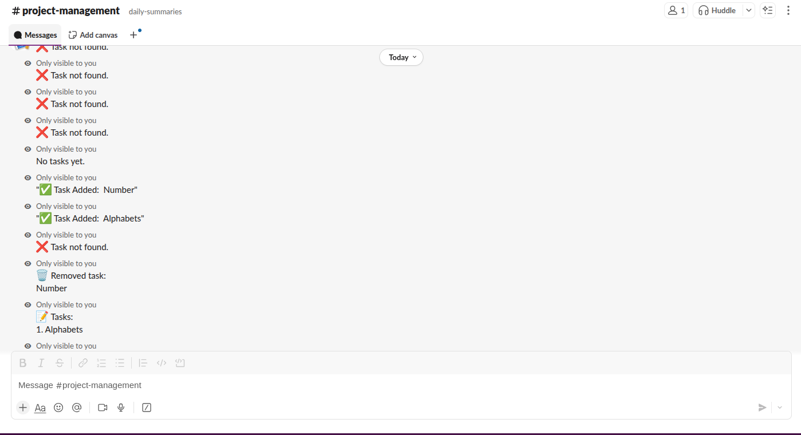

# AI Project Manager Assistant

This project is an API server for a Slack-integrated project manager assistant bot. It enables teams to manage daily standups, tasks, and meeting summaries directly from Slack.

---

## Features

- **Slack Integration:** Responds to custom Slack slash commands for seamless team collaboration.
- **Task Management:** Add, view, and delete tasks from within Slack.
- **Meeting Summaries:** Generate and retrieve daily meeting summaries based on your data.
- **Transcription Upload:** Upload meeting transcription files for further processing or summarization.
- **AI Integration Ready:** Easily connect with AI services (OpenAI, Clarifai, Weaviate, etc.) for advanced features.
- **Extensible:** The project is open to adding endpoints for any task, project management, transcription, or other suitable features as needed.

---

## Demo

**Slack Command Example:**



## Setup Guide

1. **Clone the Repository**

   ```bash
   git clone https://github.com/MehveshShabbir/service-endpoint.git
   cd service-endpoint
   ```

2. **Install Dependencies**

   ```bash
   pip install -r requirements.txt
   ```

3. **Configure Environment Variables**

   - Copy `.env.example` to `.env`.
   - Fill in all required API keys and URLs (Supabase, Slack, Clarifai, Weaviate, OpenAI, etc.).

4. **Run the FastAPI Server**

   ```bash
   uvicorn main:app --reload
   ```

5. **Expose Your Server to Slack (Development)**

   - Install and run ngrok:
     ```bash
     ngrok http 8000
     ```
   - Use the HTTPS URL provided by ngrok for Slack slash command Request URLs.

6. **Set Up Your Slack App**
   - Create a new Slack app at [https://api.slack.com/apps](https://api.slack.com/apps).
   - Add a bot user and install the app to your workspace.
   - Set up slash commands (e.g., `/addtask`, `/tasks`, `/deletetask`) in the Slack app settings, pointing each to your ngrok URL plus the endpoint.
   - Add your bot to the desired Slack channels using `/invite @your-bot-name`.

---

## Notes

- This project is intended for use within your Slack workspace. Only invited users can interact with the bot.
- For production or always-on usage, consider deploying to a cloud platform (Render, Railway, AWS, etc.) and connecting your custom domain.
- For development, ngrok is sufficient to expose your local server to Slack.

---

## License

MIT License

---

## Contact

For questions or contributions, please open an issue or pull request on GitHub.
